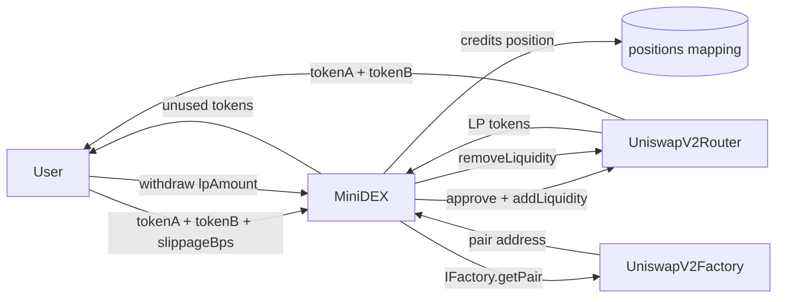

# MiniDEX — Liquidity vault manager on top of Uniswap V2

> Deposit token pairs to provide liquidity. The vault tracks your LP position on-chain so you always know your pool share — with BPS slippage protection on both deposit and withdrawal.


🔗 **Live demo:** https://mini-dex-b11.netlify.app
📜 **Contract (Sepolia):** [0x93852eB43E1739F3691a984cF4F51047d8cCa1C8](https://sepolia.etherscan.io/address/0x93852eB43E1739F3691a984cF4F51047d8cCa1C8)

---

## What it does

- Users **deposit two tokens** to add liquidity to any Uniswap V2 pair.
- LP tokens are held by the MiniDEX vault — the contract tracks each user's position.
- Unused tokens from the Uniswap rounding are **returned automatically**.
- Users can **withdraw** any portion of their LP position at any time.
- Slippage on both deposit and withdrawal is specified in **basis points** — no raw min-amount math needed.
- `getPoolShareBps` shows a user's **percentage of the pool** as BPS.

## How it works



## Tech stack

| Layer | Tech |
|-------|------|
| Smart contract | Solidity 0.8.24 |
| Standards | OpenZeppelin SafeERC20, ReentrancyGuard |
| DEX integration | Uniswap V2 Router + Factory + Pair interfaces |
| Dev / testing | Foundry + Mock Router/Factory/Pair (no fork needed) |
| Frontend | Next.js + wagmi + viem + RainbowKit |
| Network | Ethereum Sepolia testnet |

## Key design decisions

**Vault holds LP tokens, not the user**
LP tokens are credited to users via an internal `positions` mapping. This makes the UX cleaner (users don't need to track LP tokens manually) and enables future features like position-based rewards.

**`IFactory.getPair` for LP token discovery**
When withdrawing, the vault uses `IFactory.getPair(tokenA, tokenB)` to find the pair contract. This is the key B11 concept — the factory is the source of truth for pair addresses. We never hardcode token pairs.

**BPS slippage on both sides**
`deposit` computes `amountAMin = desired × (1 - slippageBps/10000)` before calling `addLiquidity`. `withdraw` computes min amounts from current reserves via `getReserves`, then applies the same formula before calling `removeLiquidity`.

**CEI pattern in `withdraw`**
Position is decremented before the external call to the router. This prevents a reentrancy attack where a malicious token's callback could re-enter `withdraw` and drain the position twice.

**MockRouter/Factory/Pair for testing**
No mainnet fork needed. Mocks implement the exact interfaces used by MiniDEX — this keeps tests fast (< 40ms) and deterministic.

## Testing ⭐

```bash
forge test -vvv
```

21 tests covering:
- ✅ Constructor sets addresses and reverts on zero
- ✅ Deposit credits LP position to user
- ✅ Deposit returns unused tokens after Uniswap rounding
- ✅ Deposit accumulates across multiple calls
- ✅ Reverts: zero amount, expired deadline
- ✅ Withdraw reduces position correctly
- ✅ Partial withdraw leaves remaining position intact
- ✅ Withdraw sends tokens to user
- ✅ Reverts: insufficient position, zero amount, expired deadline
- ✅ `getPosition` returns 0 before deposit, correct amount after
- ✅ `getPoolShareBps` returns 0 for unknown pair, nonzero after deposit
- ✅ **Fuzz:** 1000 random deposit amounts — LP always > 0 and position always credited

## Run locally

```bash
forge build
forge test -vvv

cp .env.example .env
# fill in SEPOLIA_RPC_URL and PRIVATE_KEY
source .env && forge script script/Deploy.s.sol \
  --rpc-url $SEPOLIA_RPC_URL --private-key $PRIVATE_KEY --broadcast
```

## What I learned

The `IFactory.getPair` pattern is the key primitive that makes Uniswap V2 composable — any contract can discover the LP address for any pair at runtime without hardcoding. The vault pattern (holding LP tokens on behalf of users) revealed a subtle CEI issue: you must decrement the position mapping *before* the router call, not after, because a malicious token could re-enter during `transfer`. Also: Uniswap's `addLiquidity` almost never uses 100% of both desired amounts due to price ratio rounding — returning the dust to the user is essential for a good UX.

---

## Contact

**Armando Ochoa** · Smart Contract Developer
📧 armaochoa99@gmail.com · Open to Web3 opportunities.

> Built as part of my blockchain developer journey.
